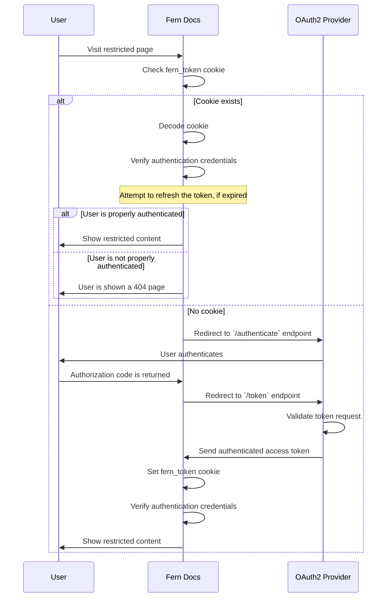

```mermaid
sequenceDiagram
    participant U as User
    participant F as Fern Docs
    participant A as OAuth2 Provider
    U->>F: Visit restricted page
    F->>F: Check fern_token cookie
    
    alt Cookie exists
        F->>F: Decode cookie
        F->>F: Verify authentication credentials
        Note over F: Attempt to refresh the token, if expired
        
        alt User is properly authenticated
            F->>U: Show restricted content
        else User is not properly authenticated
            F->>U: User is shown a 404 page
        end
    else No cookie
        F->>A: Redirect to `/authenticate` endpoint
        A->>U: User authenticates
        U->>F: Authorization code is returned
        F->>A: Redirect to `/token` endpoint
        A->>A: Validate token request
        A->>F: Send authenticated access token
        F->>F: Set fern_token cookie
        F->>F: Verify authentication credentials
        F->>U: Show restricted content
    end
```