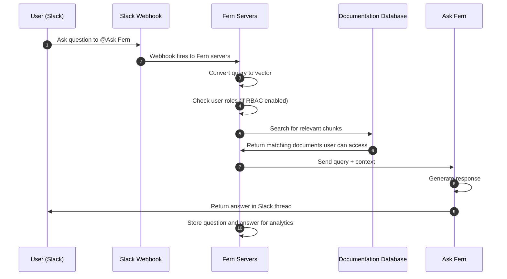

Ask Fern Slack 应用允许客户直接在 Slack 频道中询问有关您产品的问题，并从您的文档数据库中获得 AI 生成的答案。

Fern 存储来自 Slack 交互的所有问题和答案用于[分析目的](/learn/zh/docs/ai-features/ask-fern/overview#analytics)。

## 设置

在您的工作区中安装 Ask Fern 应用并将机器人添加到客户频道。

<Note>
  要在您组织的 Slack 工作区中安装 Ask Fern，您必须是 Slack 管理员。
</Note>

<Steps>
<Step title="获取您的专属安装链接">

使用 [API Explorer](/learn/zh/docs/ai-features/ask-fern/api-reference/slack-ask-fern/get-slack-install-link) 获取您组织的专属 Slack 安装链接。请提供：
- 您的 Fern token
- 您的域名（不包含协议或路径，例如 `website.com`，而不是 `https://website.com/docs`）

您也可以使用这个 cURL 请求：
```bash
curl -G https://fai.buildwithfern.com/slack/get-install \
     -H "Authorization: Bearer <YOUR_FERN_TOKEN>" \
     --data-urlencode domain=<YOUR_DOMAIN>
```

按照 `install_url` 响应字段中返回的 URL 操作。

</Step>
<Step title="添加到您的工作区">
您将被重定向到 Slack 以授权 Ask Fern 应用。选择您要添加 Ask Fern 的工作区并点击**允许**。

<Frame>
  
</Frame>

</Step>
<Step title="添加到客户频道">

在工作区中安装完成后，将机器人添加到客户 Slack 频道以便它可以访问。客户将看到 `@Ask Fern was added to the channel` 并可以立即开始提问。

</Step>
</Steps>

## 配置

自定义机器人行为以匹配您的工作流程需求。

### 每个频道的机器人设置

在任何频道中使用 `/fern` 斜杠命令来调整设置：

| 命令 | 描述 | 示例 |
|---------|-------------|---------|
| **respond_to** | 控制 Ask Fern 机器人是否响应所有消息 (`all`)、仅在直接提及 `@Ask Fern` 时响应 (`mentions_only`)，或根据上下文确定何时响应消息 (`auto`)。默认设置为 `auto`。 | `/fern respond_to all` |
| **roles** | 指定应使用哪些 RBAC 角色（逗号分隔）来过滤 Ask Fern 响应（如果您已配置[基于角色的访问控制](/learn/zh/docs/authentication/features/rbac)） | `/fern roles developer,admin` |
| **show** | 显示当前设置 | `/fern show` |
| **help** | 获取 Ask Fern 斜杠命令的帮助 | `/fern help` |

<Frame caption="配置 respond_to all 后，机器人即使未被直接提及也会响应消息">
  
</Frame>

### 自定义机器人名称

您可以重命名机器人以匹配您的品牌（例如："YourCompanyName Support"）：

1. 在 Slack 中，转到侧边栏中的**应用**并点击 **Ask Fern**
2. 点击**关于**选项卡，然后点击**配置**
3. 滚动到**机器人用户**部分并点击**编辑**
4. 输入您首选的机器人名称并保存更改

<Frame>
  
</Frame>

现在客户将看到 `@YourCompanyName Support was added to the channel` 而不是默认的 `@Ask Fern` 名称。

### 协作式 FAQ 生成

您可以通过从真实的客户交互中学习来改进 Slack 机器人的知识库。当机器人在 Slack 中提供答案时，您可以完善这些回应并将其保存以供将来参考。

工作原理：

1. **用户提问** - 机器人在频道中回应
2. **审查回应** - 如果答案需要改进，请在机器人消息的主题中回复
3. **提供更正** - 添加遗漏的上下文、纠正不准确之处或澄清回应
4. **请求索引** - 要求机器人索引改进的回应（例如"索引这个回应"或"请保存这个"）
5. **根据需要迭代** - 机器人将生成改进的答案。继续完善直到您满意
6. **确认索引** - 当回应看起来良好时，告诉机器人保存它。机器人将确认问答对已被索引

一旦索引完成，Ask Fern 将使用这个精心策划的问答对来为类似问题的未来回应提供信息，随着时间的推移提供更准确的答案。


<Accordion title="索引对话示例">

**用户 –** *@PlantSupport* 室内多肉植物的最佳养护方法是什么？

**Plant Support bot –** 多肉植物需要明亮的间接光照，应该每 2-3 周浇一次水。确保土壤在两次浇水之间完全干透。

**支持主管 –** *@PlantSupport* 这很好，但你应该提到排水孔和根腐病的风险。另外，浇水频率取决于季节 - 冬天要少一些。让我们索引这个主题。

**Plant Support bot:** 我很乐意帮助您索引这个主题！让我与您合作为您的知识库创建一个清晰的问答对。基于对话，主要问题是关于室内多肉植物的养护。让我起草一个改进的问答对：

问题："室内多肉植物的最佳养护方法是什么？"

理想回应：

多肉植物在室内茁壮成长需要以下养护：

- 光照：提供明亮的间接阳光（朝南或朝东的窗户附近每天 6+ 小时）
- 浇水：春夏季节每 2-3 周彻底浇水一次，冬季减少到每月一次。浇水之间始终等待土壤完全干透
- 排水：使用有排水孔的花盆和排水良好的土壤（仙人掌/多肉植物混合土）以防止根腐病
- 警告：过度浇水是多肉植物死亡的最常见原因。根腐病在积水的土壤中发展很快

这是否准确捕获了问题和回应？您希望我在保存到您的知识库之前调整什么吗？

**支持主管:** *@PlantSupport* 完美！请保存这个。

**Plant Support bot –** 索引成功！这个问答对已添加到您的知识库，将用于为有关室内多肉植物养护的未来回应提供信息。

</Accordion>


## 架构

当用户在 Slack 中向 Ask Fern 提问时，webhook 触发 Fern 服务器搜索您的文档数据库并检索相关上下文。使用该上下文，Ask Fern 生成回应。

<Accordion title="架构图">

</Accordion>