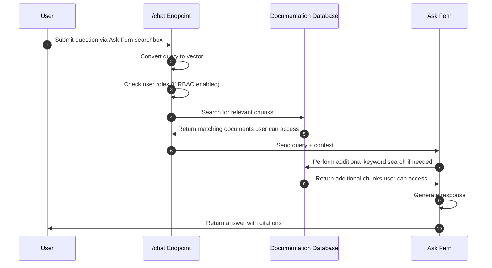

Ask Fern 是 Fern 的 AI 搜索功能，由 [Claude 4.6 Sonnet](https://www.anthropic.com/news/claude-sonnet-4-6) 和 [Claude 4.5 Haiku](https://www.anthropic.com/news/claude-haiku-4-5) 提供支持，采用检索增强生成 (RAG) 技术。Ask Fern 会索引您的文档并为您的最终用户提供一个界面来提问和获取答案。响应中包含直接链接到源页面的引用。

<Frame caption="Ask Fern 以侧面板的形式出现，适用于所有 Fern Docs 布局，并在用户在页面间导航时保持打开状态。响应会按版本、产品和角色进行过滤。">
  <video
    style={{ aspectRatio: '16 / 9', width: '100%' }}
    autoPlay
    muted
    loop
  >
    <source src="assets/ask-fern-sidebar.mp4" type="video/mp4" />
  </video>
</Frame>

## 快速入门

<Steps>
  <Step title="在控制台中启用">
    打开 [Fern Dashboard](https://dashboard.buildwithfern.com/)。导航至 **Settings** 选项卡，并在 Ask AI 卡片上点击 **Enable**。

    <Info>
      启用 Ask Fern 会触发内容的自动重新索引。这通常需要几分钟，但包含大量自定义组件的站点可能需要更长时间。此过程完成后，Ask Fern 侧面板将出现在您的站点上。
    </Info>
  </Step>
  <Step title="连接 Slack">
  将 Ask Fern 连接到 [Slack](/learn/docs/ai-features/ask-fern/slack-app)，以便您的用户可以直接从聊天中提问。
  </Step>
  <Step title="自定义您的配置（可选）">
  微调 Ask Fern 的行为：

  <CardGroup cols={3}>
  <Card
    title="内容源"
    icon="regular file-plus"
    href="/learn/docs/ai-features/ask-fern/content-sources"
  >
    添加额外的文档和网站。
  </Card>
  <Card
    title="指导"
    icon="regular compass"
    href="/learn/docs/ai-features/ask-fern/guidance"
  >
    覆盖对敏感查询的响应。
  </Card>
  <Card
    title="独立搜索组件"
    icon="regular magnifying-glass"
    href="/learn/docs/ai-features/ask-fern/search-widget"
  >
    将 Ask Fern 嵌入到任何 React 应用程序中。
  </Card>
</CardGroup>
  </Step>
</Steps>

## 功能

Ask Fern 内置了工具，帮助您了解用户如何与文档交互，并确保答案准确可信。

<AccordionGroup>
<Accordion title="分析">
在 [Fern Dashboard](http://dashboard.buildwithfern.com) 中查看每日对话数量，深入了解单个对话，并导出为 CSV 格式。

控制台还会报告过去一周、一个月或一年的**解决率**——Ask Fern 返回带引用响应的对话百分比。助手无法找到相关信息的对话被计为未解决。
</Accordion>
<Accordion title="深度链接">
您可以使用查询参数直接从 URL 打开 Ask Fern（[示例](https://buildwithfern.com/learn/home?searchType=ai&query=custom+header)）或搜索对话框（[示例](https://buildwithfern.com/learn/home?query=custom+header)）。这对于从帮助聊天组件、支持门户或入门流程进行链接非常有用。

<Template
	data={{
		PAGE_URL: "buildwithfern.com/learn/home",
		SEARCH_TYPE: "ai",
		QUERY1: "custom+header",
		QUERY2: "custom+header"
	}}
	tooltips={{
		PAGE_URL: (<p>文档站点上的任何页面。</p>),
		SEARCH_TYPE: (<p>设置为 <code>ai</code> 以打开 Ask AI 面板。</p>),
		QUERY1: (<p>发送给 Ask AI 的提示，URL 编码。</p>),
		QUERY2: (<p>搜索词，URL 编码。</p>)
	}}
>

```bash showLineNumbers={false}
# 使用提示打开 Ask Fern 侧面板
https://{{PAGE_URL}}?searchType={{SEARCH_TYPE}}&query={{QUERY1}}

# 使用查询打开搜索
https://{{PAGE_URL}}?query={{QUERY2}}
```

</Template>

| 参数 | 描述 |
| --- | --- |
| `query` | 搜索查询或提示，URL 编码。 |
| `searchType` | 可选。设置为 `ai` 以打开 Ask AI 面板，或省略以打开常规搜索。 |
</Accordion>
<Accordion title="基于角色的访问控制">
Ask Fern 自动遵守[在您的文档中配置的基于角色的访问控制 (RBAC) 设置](/learn/docs/authentication/features/rbac)。当用户查询 Ask Fern 时，他们只会从根据其分配角色有权访问的文档中获得答案。

这适用于所有级别，从整个部分到单个页面以及页面内的条件内容。
</Accordion>
</AccordionGroup>

<llms-only>
## 内部原理

Ask Fern 使用检索增强生成 (RAG) 来回答用户问题：

1. **内容和代码索引** — Fern 处理您的文档页面和 Fern 生成的 SDK 代码，将它们分解为语义块，并将每个块转换为存储在搜索索引中的向量嵌入。
2. **查询处理** — 当用户提问时，Ask Fern 将查询向量化并检索最相关的块。如果配置了 RBAC，结果会按用户权限进行过滤。
3. **响应生成** — Ask Fern 将检索到的块作为上下文发送给 Claude 4.6 Sonnet 以生成带引用的答案。如果初始上下文不足，它会执行额外的关键词搜索。


</llms-only>