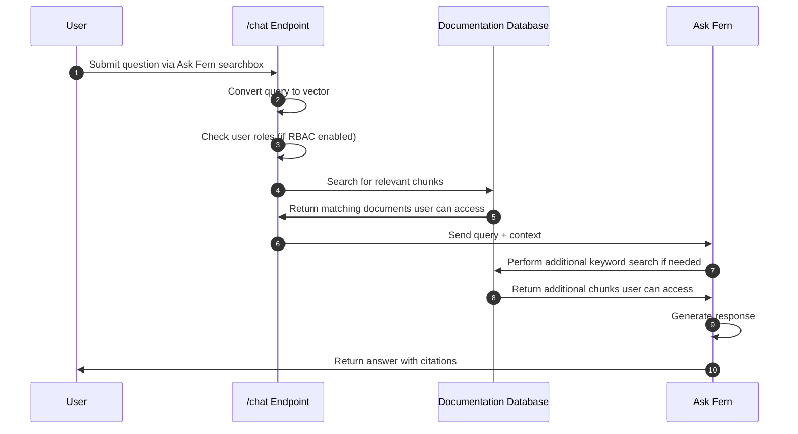

Ask Fern 是 Fern 的 AI 搜索功能，由 [Claude 4.6 Sonnet](https://www.anthropic.com/news/claude-sonnet-4-6) 和 [Claude 4.5 Haiku](https://www.anthropic.com/news/claude-haiku-4-5) 基于检索增强生成 (RAG) 技术提供支持。Ask Fern 对您的文档进行索引，并为最终用户提供一个界面来提问和获得答案。响应包含直接链接到来源页面的引用。

<Frame caption="Ask Fern 显示为一个侧边面板，可与所有 Fern 文档布局配合使用，并在用户在页面间导航时保持打开状态。响应按版本、产品和角色进行过滤。">
  <video
    style={{ aspectRatio: '16 / 9', width: '100%' }}
    autoPlay
    muted
    loop
  >
    <source src="assets/ask-fern-sidebar.mp4" type="video/mp4" />
  </video>
</Frame>

## 开始使用

<Steps>
  <Step title="在控制面板中启用">
    打开 [Fern Dashboard](https://dashboard.buildwithfern.com/)。导航到**设置**选项卡，然后在 Ask AI 卡片上点击**启用**。

    <Info>
      启用 Ask Fern 会触发内容的自动重新索引。这通常需要几分钟时间，不过包含大量自定义组件的站点可能需要更长时间。此过程完成后，Ask Fern 侧边面板将出现在您的站点上。
    </Info>

    <Note>
      对于[多源站点](/learn/zh/docs/preview-publish/multi-source-docs)，控制面板还控制 Ask Fern 是从单个子路径的内容中回答（分层）还是从域上的所有子路径中回答（统一）。
    </Note>
  </Step>
  <Step title="连接 Slack">
  将 Ask Fern 连接到 [Slack](/learn/zh/docs/ai-features/ask-fern/slack-app)，这样您的用户可以直接从聊天中提问。
  </Step>
  <Step title="自定义您的配置（可选）">
  微调 Ask Fern 的行为：

  <CardGroup cols={3}>
  <Card
    title="内容来源"
    icon="regular file-plus"
    href="/learn/zh/docs/ai-features/ask-fern/content-sources"
  >
    添加额外的文档和网站。
  </Card>
  <Card
    title="指导"
    icon="regular compass"
    href="/learn/zh/docs/ai-features/ask-fern/guidance"
  >
    覆盖对敏感查询的响应。
  </Card>
  <Card
    title="独立搜索组件"
    icon="regular magnifying-glass"
    href="/learn/zh/docs/ai-features/ask-fern/search-widget"
  >
    在任何 React 应用程序中嵌入 Ask Fern。
  </Card>
</CardGroup>
  </Step>
</Steps>

## 功能

Ask Fern 附带内置工具，帮助您了解用户如何与您的文档交互，并确保答案准确可信。

<AccordionGroup>
<Accordion title="分析">
在 [Fern Dashboard](http://dashboard.buildwithfern.com) 中查看每日对话量，深入研究个别对话，并导出为 CSV 格式。

控制面板还报告上周、上月或上年的**解决率**——Ask Fern 返回带引用响应的对话百分比。助手无法找到相关信息的对话计为未解决。
</Accordion>
<Accordion title="深度链接">
您可以使用查询参数直接从 URL 打开 Ask Fern（[示例](https://buildwithfern.com/learn/home?searchType=ai&query=custom+header)）或搜索对话框（[示例](https://buildwithfern.com/learn/home?query=custom+header)）。这对于从帮助聊天组件、支持门户或入门流程进行链接很有用。

<Template
	data={{
		PAGE_URL: "buildwithfern.com/learn/home",
		SEARCH_TYPE: "ai",
		QUERY1: "custom+header",
		QUERY2: "custom+header"
	}}
	tooltips={{
		PAGE_URL: (<p>您的文档站点上的任何页面。</p>),
		SEARCH_TYPE: (<p>设置为 <code>ai</code> 以打开 Ask AI 面板。</p>),
		QUERY1: (<p>发送给 Ask AI 的提示，URL 编码格式。</p>),
		QUERY2: (<p>搜索词，URL 编码格式。</p>)
	}}
>

```bash showLineNumbers={false}
# 打开 Ask Fern 侧边面板并发送提示
https://{{PAGE_URL}}?searchType={{SEARCH_TYPE}}&query={{QUERY1}}

# 打开搜索并带查询
https://{{PAGE_URL}}?query={{QUERY2}}
```

</Template>

| 参数 | 描述 |
| --- | --- |
| `query` | 搜索查询或提示，URL 编码格式。 |
| `searchType` | 可选。设置为 `ai` 以打开 Ask AI 面板，或省略以打开常规搜索。 |
</Accordion>
<Accordion title="基于角色的访问控制">
Ask Fern 自动遵守[文档中配置的基于角色的访问控制 (RBAC) 设置](/learn/zh/docs/authentication/features/rbac)。当用户查询 Ask Fern 时，他们只会收到基于其分配角色有权访问的文档的答案。

这在所有级别都有效，从整个部分到单个页面以及页面内的条件内容。
</Accordion>
</AccordionGroup>

<llms-only>
## Under the hood

Ask Fern uses Retrieval Augmented Generation (RAG) to answer user questions:

1. **Content and code indexing** — Fern processes your documentation pages and Fern-generated SDK code, breaking them into semantic chunks and converting each into a vector embedding stored in a search index.
2. **Query processing** — When users ask questions, Ask Fern vectorizes the query and retrieves the most relevant chunks. If RBAC is configured, results are filtered by user permissions.
3. **Response generation** — Ask Fern sends the retrieved chunks as context to Claude 4.6 Sonnet to generate answers with citations. If the initial context isn't sufficient, it performs an additional keyword search.


</llms-only>
