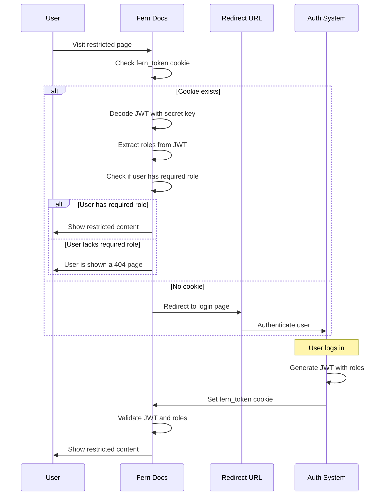

<Markdown src="/snippets/enterprise-plan.mdx"/>

使用 JWT，您可以管理整个身份验证流程。这涉及构建和签署一个 [`fern_token`](/learn/zh/docs/authentication/overview#how-authentication-works) cookie，将您的文档与现有登录系统集成。与 [OAuth](/learn/zh/docs/authentication/setup/oauth) 类似，JWT 支持：

- **仅登录** — 通过身份验证来保护文档
- **[RBAC](/learn/zh/docs/authentication/features/rbac)** — 按用户角色限制内容
- **[API 密钥注入](/learn/zh/docs/authentication/features/api-key-injection)** — 在 [API Explorer](/learn/zh/docs/api-references/api-explorer) 中预填充 API 密钥

## 工作原理

1. 用户在您的文档站点上点击 **登录**，然后被重定向到您的身份验证页面。
2. 身份验证后，您的系统使用来自 Fern 的密钥签署一个 [JWT](https://jwt.io)，并将其设置为 `fern_token` cookie。
3. Fern 读取令牌以确定用户的访问权限和凭据。

<Accordion title="架构图">

</Accordion>

## 配置

<Steps>
<Step title="获取您的密钥">
联系 Fern 获取您的密钥，并向他们发送您的身份验证页面 URL。这是用户点击 **登录** 后被重定向的地方。
</Step>

<Step title="构建 `fern` 声明">
JWT 负载必须包含一个 `fern` 声明。您在令牌的 `fern` 声明中包含的内容控制启用的功能：仅登录、RBAC 或 API 密钥注入。

<CodeBlocks>
```json 仅登录
{
  "fern": {}
}
```

```json RBAC
{
  "fern": {
    "roles": ["partners"]
  }
}
```

```json API 密钥注入
{
  "fern": {
    "playground": {
      "initial_state": {
        "auth": { "bearer_token": "eyJhbGciOiJIUzI1c" }
      }
    }
  }
}
```

```json API 密钥注入 + RBAC
{
  "fern": {
    "roles": ["partners"],
    "playground": {
      "initial_state": {
        "auth": { "bearer_token": "eyJhbGciOiJIUzI1c" }
      }
    }
  }
}
```
</CodeBlocks>
</Step>

<Step title="设置 `fern_token` cookie">
在您的服务中添加逻辑，在用户登录时签署 JWT 并将其设置为 `fern_token` cookie。

<Accordion title="示例：完整的回调端点">
这个 Next.js 端点处理来自您的身份验证页面的回调。它读取 `state` 参数来确定将用户重定向到何处，使用 [jose](https://github.com/panva/jose) 生成 `fern_token` JWT，将其设置为 cookie，并将用户重定向回文档。

```typescript title="app/api/fern-token/route.ts"
import { SignJWT } from "jose";
import { cookies } from "next/headers";
import { type NextRequest, NextResponse } from "next/server";

export async function GET(req: NextRequest): Promise<NextResponse> {
  const domain = getDomain(req); // your logic to determine the docs domain

  // use the state param to determine redirect location
  const returnTo = req.nextUrl.searchParams.get("state");
  const redirectLocation = returnTo ?? `https://${domain}`;

  // fetch the user's API key, roles, and secret (from your config or database)
  const apiKey = await getApiKeyForUser();
  const roles = await getRolesForUser();
  const secret = await getSecretForDomain(domain);

  if (!secret) {
    // redirect with an error if credentials are missing
    const url = new URL(redirectLocation);
    url.searchParams.set("error", "missing_credentials");
    return NextResponse.redirect(url);
  }

  // mint the JWT using the secret key
  const fernToken = await mintFernToken({ secret, apiKey, roles });

  if (!fernToken) {
    const url = new URL(redirectLocation);
    url.searchParams.set("error", "token_creation_failed");
    return NextResponse.redirect(url);
  }

  // set the fern_token as a cookie on the docs domain
  const cookieJar = await cookies();
  cookieJar.set("fern_token", fernToken, {
    httpOnly: true,
    secure: true,
    sameSite: "lax",
    domain,
  });

  // redirect the user back to the docs
  return NextResponse.redirect(redirectLocation);
}

const encoder = new TextEncoder();

async function mintFernToken({
  secret,
  apiKey,
  roles,
}: {
  secret: string;
  apiKey?: string;
  roles?: string[];
}): Promise<string> {
  const fern: Record<string, unknown> = {};

  if (roles) {
    fern.roles = roles;
  }

  if (apiKey) {
    fern.playground = {
      initial_state: {
        auth: {
          bearer_token: apiKey,
        },
      },
    };
  }

  return await new SignJWT({ fern })
    .setProtectedHeader({ alg: "HS256", typ: "JWT" })
    .setIssuedAt()
    .setExpirationTime("1d") // set to any value
    .setIssuer("https://buildwithfern.com")
    .sign(encoder.encode(secret)); // sign using the secret provided by Fern
}
```
</Accordion>
</Step>

<Step title="启用 RBAC 或 API 密钥注入（可选）">
一旦您的 `fern_token` 工作正常，配置您需要的功能：

- **[基于角色的访问控制](/learn/zh/docs/authentication/features/rbac)** — 在 `docs.yml` 中定义角色，并按角色限制导航项或页面内容。
- **[API 密钥注入](/learn/zh/docs/authentication/features/api-key-injection)** — 配置 `playground` 负载，包括自定义标头、多个 API 密钥和按环境凭据。
</Step>
</Steps>