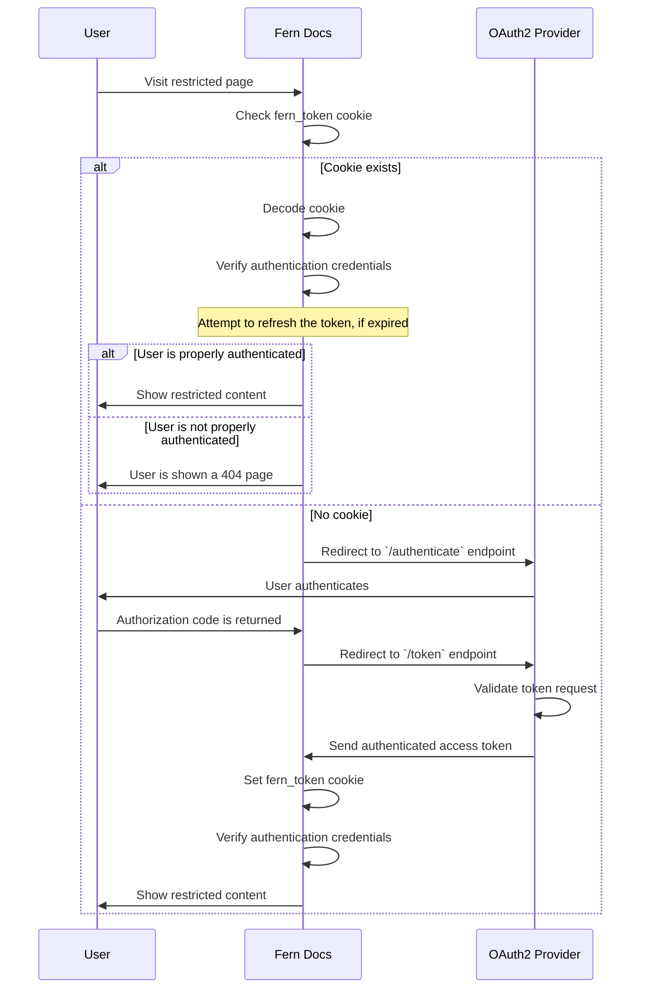

<Markdown src="/snippets/enterprise-plan.mdx"/>

使用 OAuth，Fern 为您管理身份验证流程。您为 Fern 提供访问您的 OAuth 提供商的权限，Fern 处理 [`fern_token`](/learn/zh/docs/authentication/overview#how-authentication-works) cookie，将您的文档与现有登录系统集成。与 [JWT](/learn/zh/docs/authentication/setup/jwt) 一样，OAuth 支持：

- **[RBAC](/learn/zh/docs/authentication/features/rbac)** — 按用户角色限制内容
- **[API 密钥注入](/learn/zh/docs/authentication/features/api-key-injection)** — 在 [API 探索器](/learn/zh/docs/api-references/api-explorer)中预填充 API 密钥

## 工作原理

1. 用户在您的文档站点上点击**登录**，Fern 启动与您提供商的 OAuth 流程。
1. 用户在您的 OAuth 提供商登录页面进行身份验证。
1. 您的提供商使用授权码重定向回 Fern，Fern 将其交换为访问令牌。
1. Fern 设置包含用户访问权限和凭据的 `fern_token` cookie。
1. 当用户点击**登出**时，Fern 清除会话 cookie。如果配置了登出 URL，用户将被重定向到您的 OAuth 提供商的登出端点以结束那里的会话。

<Accordion title="架构图">

</Accordion>

## 配置

<Steps>
<Step title="创建 OAuth 客户端">
转到您的 OAuth 提供商的控制面板，创建一个新的**Web 应用程序**客户端。
</Step>

<Step title="将 Fern 回调添加到允许列表">
在您的 OAuth 提供商中将以下回调添加到允许列表：
`https://<your-domain>/api/fern-docs/oauth2/callback`。

将 `<your-domain>` 替换为您的 Fern 文档域名。如果您同时使用 `.docs.buildwithfern.com` 和自定义域名，请将两者都添加到允许列表。
</Step>

<Step title="将 OAuth 客户端详细信息发送给 Fern">
将以下信息发送到 support@buildwithfern.com 或您专用的 Slack 频道：

- [ ] 文档域名
- [ ] 客户端 ID
- [ ] 客户端密钥
- [ ] 授权 URL（例如 `https://<your-oauth-tenant>/oauth2/authorize`）
- [ ] 令牌 URL（例如 `https://<your-oauth-tenant>/oauth2/token`）
- [ ] 作用域（例如 `openid`、`profile`、`email`）
- [ ] 发行者 URL（例如 `https://<your-domain>`）
- [ ] 登出 URL（可选，例如 `https://<your-oauth-tenant>/oauth2/logout`）

<Note title="指定受众">
如果您的客户端连接到 API，您可能需要在身份验证请求中指定受众。

更新后的授权 URL 可能如下所示：`https://<your-oauth-tenant>/oauth2/authorize?audience=<your-api-identifier>`
</Note>
</Step>

<Step title="等待 Fern 配置 OAuth">
Fern 将在您的站点上配置 OAuth。身份验证准备就绪时，您将收到通知。
</Step>

<Step title="启用 RBAC 或 API 密钥注入（可选）">
OAuth 工作后，配置您需要的功能：

<AccordionGroup>
<Accordion title="RBAC">
<Steps>
<Step title="添加自定义声明">
将自定义声明添加到您的 OAuth 提供商的令牌响应中，以便 Fern 可以确定每个用户的角色。生成的令牌响应应该如下所示：

```json {12-15} maxLines=7 startLine=10
{
  "iss": "https://your-tenant.us.auth0.com/",
  "sub": "auth0|507f1f77bcf86cd799439011",
  "aud": "your_client_id_here",
  "iat": 1728388800,
  "exp": 1728475200,
  "email": "user@example.com",
  "email_verified": true,
  "name": "John Doe",
  "nickname": "johndoe",
  "picture": "https://s.gravatar.com/avatar/...",
  "roles": [
    "custom-role",
    "user-specific-role"
  ]
}
```

<Warning title="使用 `roles` 以外的声明">
一些 OAuth 提供商对自定义声明有严格要求。如果您需要使用 `roles` 以外的声明，请联系 Fern 并指定应该解析哪个声明来获取用户角色。
</Warning>

<Accordion title="使用 Auth0">
要向 Auth0 添加自定义声明，您需要创建一个**自定义操作**。此操作将用于向令牌响应添加自定义声明。

1. 转到 Auth0 控制面板中的**操作**标签。
2. 创建一个**自定义操作**。
3. 选择**登录/登录后**。
4. 添加设置角色的逻辑。
    ```js Example Action
    exports.onExecutePostLogin = async (event, api) => {
      const roles = event.user.app_metadata?.roles; // or however you store user roles

      if (roles) {
        const namespace: "https://<your-domain>.com"; // important: custom claims must be namespaced
        api.accessToken.setCustomClaim(`${namespace}/roles`, roles);
      }
    };
    ```
5. 点击**创建**。
6. 将操作添加到您的**登录后流程**。
</Accordion>
</Step>
<Step title="配置 RBAC">
一旦您的令牌响应包含角色，在 `docs.yml` 中定义这些角色并将其分配给导航项和页面内容。完整设置请参阅[基于角色的访问控制](/learn/zh/docs/authentication/features/rbac)。
</Step>
</Steps>

</Accordion>
<Accordion title="API 密钥注入">
为 Fern 设置一个经过身份验证的账户，以便 Fern 可以代表您对用户进行授权，并配置您的 OAuth 应用程序在 Fern 请求令牌时返回用户 API 密钥。联系 support@buildwithfern.com 协调此设置。
</Accordion>
</AccordionGroup>
</Step>

</Steps>