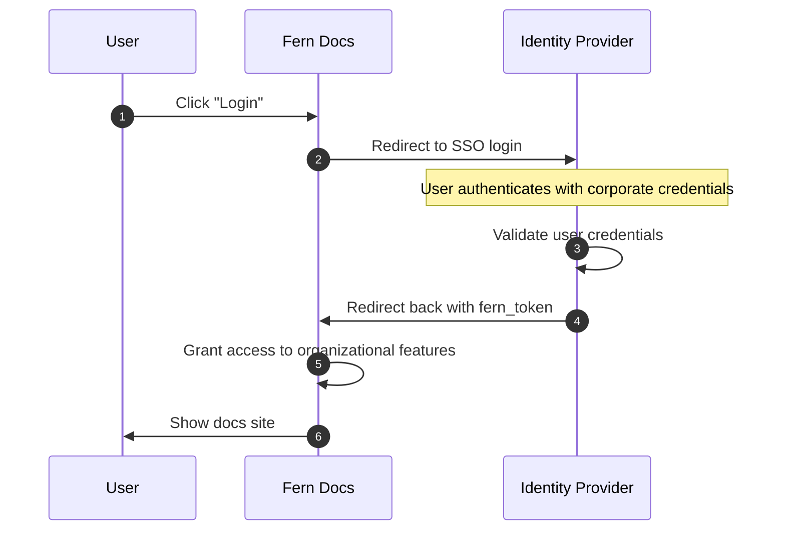

<Markdown src="/snippets/enterprise-plan.mdx"/>

SSO 让您的团队通过您组织的身份提供商使用 SAML 2.0 或 OIDC 访问您的文档。与[RBAC](/learn/zh/docs/authentication/features/rbac)和[API 密钥注入](/learn/zh/docs/authentication/features/api-key-injection)一样，SSO 使用[`fern_token`](/learn/zh/docs/authentication/overview#how-authentication-works) cookie 来识别已认证的用户。SSO 解锁了用于浏览器编辑的[Fern Editor](/learn/zh/docs/writing-content/fern-editor)和[认证预览链接](/learn/zh/docs/preview-publish/preview-changes#preview-links)。

<Note>SSO 提供基于登录的访问控制，但不支持角色管理或 API 密钥注入。要进行细粒度访问控制，请使用[RBAC](/learn/zh/docs/authentication/features/rbac)。</Note>

## 工作原理

当用户点击**登录**时，Fern 会将他们重定向到您的身份提供商。使用企业凭据验证身份后，身份提供商会重定向回 Fern 并提供 `fern_token`，授予访问您文档的权限。

<Accordion title="架构图">

</Accordion>

## 设置

Fern 支持任何 SAML 2.0 或 OIDC 提供商（Okta、Google Workspace、Auth0、Azure AD、OneLogin 等）。[联系 Fern](https://buildwithfern.com/book-demo)或通过 Slack 联系我们。Fern 将与您的安全团队合作连接到您的身份提供商。