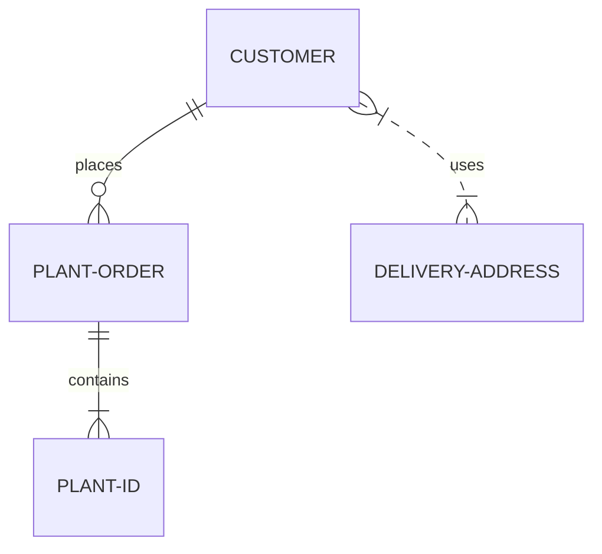

使用富媒体内容增强您的文档，包括图像、视频、PDF、数学方程式和图表。

## 图像

您可以使用本地存储的图像或 URL 在 Markdown 页面中包含图像。使用 [Markdown 语法](https://www.markdownguide.org/basic-syntax/#images-1) 或 [`` HTML 标签](https://developer.mozilla.org/en-US/docs/Web/HTML/Element/img) 来插入图像。不要使用 `<embed>` 元素，因为它的浏览器支持不一致。

<Info title="图像路径">
  您可以使用相对于页面位置的路径（使用 `./` 或 `../`）或相对于 `fern` 文件夹根目录的路径（使用 `/`）来引用图像。例如，位于 `fern/assets/images/logo.png` 的图像可以从任何页面引用为 `/assets/images/logo.png`。
</Info>

<Tabs>
  <Tab title="Markdown">
    ```markdown
    <!-- 相对于页面位置 -->
    

    <!-- 相对于 fern 文件夹根目录 -->
    
    ```
  </Tab>
  <Tab title="HTML">
    ```html
    <!-- 相对于页面位置 -->
    

    <!-- 相对于 fern 文件夹根目录 -->
    
    ```
  </Tab>
</Tabs>

常见图像属性：

| 属性 | 描述 |
| --------- | ----------- |
| `src` | 图像文件的 URL 或路径 |
| `alt` | 用于无障碍访问的替代文本 |
| `title` | 鼠标悬停时显示的工具提示文本 |
| `width` 和 `height` | 图像的尺寸（px） |
| `noZoom` | 禁用图像缩放功能 |

<Note>
有关 HTML 图像元素及其属性的更多详细信息，请参阅 [MDN 关于 img 元素的文档](https://developer.mozilla.org/en-US/docs/Web/HTML/Element/img)。
</Note>

## PDF

使用 `<iframe>` 元素嵌入 PDF。不要使用 `<embed>` 元素，因为它的浏览器支持不一致。

<Tabs>
<Tab title="渲染的 PDF">
<iframe src="../default-components/all-about-ferns.pdf" width="100%" height="500px" style={{ border: 'none', borderRadius: '0.5rem' }} />
</Tab>
<Tab title="PDF 语法">
```html
<iframe src="../default-components/all-about-ferns.pdf" width="100%" height="500px" style={{ border: 'none', borderRadius: '0.5rem' }} />
```
</Tab>
</Tabs>

## 视频

### 本地视频

您可以使用 HTML `<video>` 标签在文档中嵌入视频。这使您能够控制视频播放设置，如自动播放、循环播放和静音。不要使用 `<embed>` 元素，因为它的浏览器支持不一致。

<Markdown src="/products/docs/snippets/html-video-syntax-callout.mdx" />

<Tabs>
<Tab title="渲染的视频">
<video
    src="./embed-fern-waving.mp4"
    width="854"
    height="480"
    autoPlay
    loop
    muted
    controls
>
</video>
</Tab>
<Tab title="视频语法">
```html
<video
    src="path/to/your/video.mp4"
    poster="path/to/your/thumbnail.png"
    width="854"
    height="480"
    autoPlay
    loop
    playsInline
    muted
    controls
>
</video>
```

</Tab>
</Tabs>

您也可以将视频包装在容器 div 中以进行额外的样式设置：

```html
<div class="card-video">
    <video
        src="path/to/your/video.mp4"
        poster="path/to/your/thumbnail.png"
        width="854"
        height="480"
        autoPlay
        loop
        playsInline
        muted
        controls
    >
    </video>
</div>
```

常见视频属性：

| 属性 | 描述 |
| --------- | ----------- |
| `src` | 视频文件的 URL 或路径 |
| `poster` | 在视频加载期间或用户点击播放之前显示的预览图像的 URL 或路径 |
| `width` 和 `height` | 视频播放器的尺寸 |
| `autoPlay` | 视频自动开始播放 |
| `loop` | 视频完成后重复播放 |
| `playsInline` | 视频在移动设备上内联播放而不是全屏播放 |
| `muted` | 视频播放时无声音 |
| `controls` | 显示视频播放器控件（播放/暂停、音量等） |

<Note>
有关 HTML 视频元素及其属性的更多详细信息，请参阅 [MDN 关于 video 元素的文档](https://developer.mozilla.org/en-US/docs/Web/HTML/Element/video)。
</Note>

### 嵌入 YouTube 或 Loom 视频

您可以使用 `<iframe>` 元素从 YouTube、Loom、Vimeo 和其他流媒体平台嵌入视频。

<Warning>
  `.mdx` 文件使用 JSX 语法，而不是纯 HTML。在 `.mdx` 页面中嵌入的 HTML 元素（如 `<video>` 和 `<iframe>`）的属性必须用 `camelCase` 而不是小写来编写。例如，使用 `autoPlay` 而不是 `autoplay`。
</Warning>

<Tabs>
  <Tab title="渲染的 Loom 视频">
  <iframe
    src="https://www.loom.com/embed/2e7f038de6894c69bf9c0d2525b0ad7f?sid=8bb327d2-8ba6-413c-a832-8d80282ad527"
    width="100%"
    height="450px"
    frameBorder="0"
    allowFullScreen
  ></iframe>
  </Tab>
  <Tab title="Loom 视频语法">
    ```mdx
    <iframe
      src="https://www.loom.com/embed/2e7f038de6894c69bf9c0d2525b0ad7f?sid=8bb327d2-8ba6-413c-a832-8d80282ad527"
      width="100%"
      height="450px"
      frameBorder="0"
      allowFullScreen
    ></iframe>
    ```
  </Tab>
</Tabs>

请参阅 ElevenLabs 文档中相应文档页面上[渲染效果](https://elevenlabs.io/docs/conversational-ai/guides/integrations/zendesk#demo-video)的示例。

## 外部网站

您可以使用 `<iframe>` 在文档中嵌入任何外部网页。

<Info>
  如果目标站点设置了 `X-Frame-Options` 或限制性的 `Content-Security-Policy` 等响应头，浏览器将阻止嵌入。请验证您要嵌入的站点是否允许被框架嵌入。
</Info>

<Tabs>
  <Tab title="渲染的外部网站">
  <iframe
    src="https://en.wikipedia.org/wiki/Fern"
    style="width: 100%; height: 500px; border: none; border-radius: 8px;"
  ></iframe>
  </Tab>
  <Tab title="外部网站语法">
  ```mdx
  <iframe
    src="https://en.wikipedia.org/wiki/Fern"
    style="width: 100%; height: 500px; border: none; border-radius: 8px;"
  />
  ```
  </Tab>
</Tabs>

[嵌入 Fern 文档站点](/learn/docs/customization/embedded-mode)到其他应用程序时，请在 URL 后追加 `?embedded=true` 以隐藏页头和页脚。

## LaTeX

Fern 支持 [LaTeX](https://www.latex-project.org/) 数学方程式。要使用 LaTeX，请将您的内联数学方程式用 `$` 包围。例如，`$(x^2 + y^2 = z^2)$` 将渲染为 $x^2 + y^2 = z^2$。

对于显示数学方程式，请将方程式用 `$$` 包围。例如：

```latex
$$
% \f is defined as #1f(#2) using the macro
\f\relax{x} = \int_{-\infty}^\infty
    \f\hat\xi\,e^{2 \pi i \xi x}
    \,d\xi
$$
```

$$
% \f is defined as #1f(#2) using the macro
\f\relax{x} = \int_{-\infty}^\infty
    \f\hat\xi\,e^{2 \pi i \xi x}
    \,d\xi
$$

### 显示字面美元符号

包含美元金额（如价格、预算或成本）的文本可能会意外渲染为数学方程式。要显示字面美元符号，请用反斜杠（`\`）转义它们：

<div className="highlight-frame">
  <div className="highlight-frame-content">
    不转义：产品成本 $10，运费为 $5

    转义：产品成本 \$10，运费为 \$5
  </div>
</div>

```markdown Markdown wordWrap
不转义：产品成本 $10，运费为 $5
转义：产品成本 \$10，运费为 \$5
```

## 图表
Fern 支持使用 [Mermaid](https://mermaid.js.org/) 在 Markdown 中创建图表。Mermaid 提供各种图表，包括流程图、实体关系模型和甘特图。要在 Markdown 文件中包含 Mermaid 图表，请创建一个标记为 `mermaid` 的代码块。

````markdown

````

