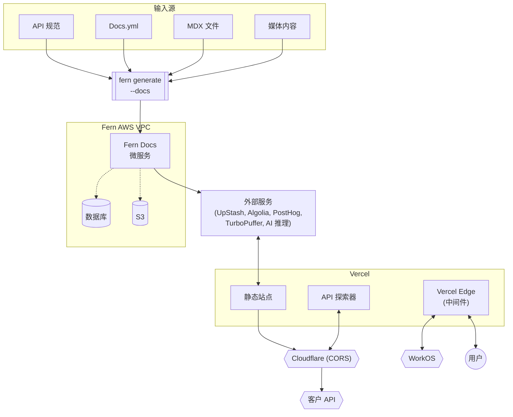
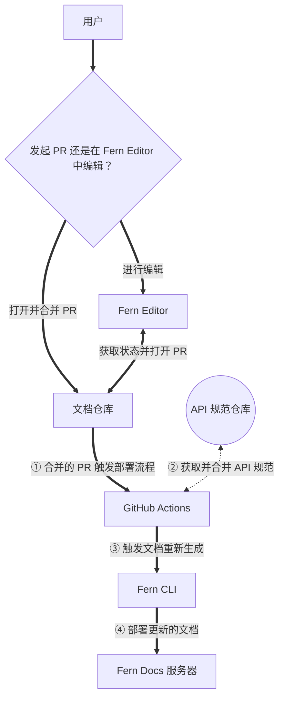

Fern 将您的 API 规范、静态 Markdown 文件（如操作指南和教程）、媒体资源（图像、视频等）以及在 `docs.yml` 文件中定义的自定义设置结合起来，生成一个美观、交互式的托管文档站点。

此过程围绕两个主要工作流程构建：**编辑**和**部署**您的文档。

<Accordion title="系统架构">

此图显示了为文档生成过程提供支持的技术基础设施。

</Accordion>

## 内容工作流程

您可以通过两种方式更新您的文档：

- **直接编辑**：直接在[包含您文档的 GitHub 仓库](/learn/zh/docs/getting-started/project-structure)中打开拉取请求（包括您的 `docs.yml` 配置和 Markdown 文件）。
- **Fern Editor**：使用 [Fern Editor](/learn/zh/docs/writing-content/fern-editor) 修改您的文档，无需接触代码。Fern GitHub App 从您的文档仓库获取当前状态并将其传递给 Fern Editor。当您提交更改时，Fern GitHub App 会自动打开一个拉取请求供审核。

更新通过您的审核流程后，审批者可以合并它。

<Info>
    您可以使用 [Fern Dashboard](http://dashboard.buildwithfern.com) 管理您的 GitHub 仓库连接、组织成员（添加或删除）、域名和 Fern CLI 版本。
</Info>

## 部署工作流程

当拉取请求合并到您的文档仓库时，自动化管道将您的内容转换为实时文档站点，并通过三个主要阶段与您的 API 更改同步：

<Steps>

### 触发 GitHub Action 并获取 API 规范

合并的 PR 触发 Fern GitHub Action。该操作使用安全令牌身份验证从单独的仓库检索您的 API 规范。GitHub Action 只能访问运行它的特定文档仓库。

### 生成并处理内容
[Fern CLI](/learn/zh/cli-api-reference/cli-reference/overview) 运行 `fern generate --docs` 来合并您的 API 规范与文档内容。在幕后，此过程涉及几个关键组件：

- **输入处理**：系统结合您的 API 规范文件、`docs.yml` 配置文件、`.mdx` 文件和媒体内容。
- **核心基础设施**：生成过程在 Fern 的 AWS VPC 基础设施上运行，其中 Fern Docs 微服务充当中心协调器。此微服务协调内容处理，同时连接到用于存储索引内容的数据库和用于资源存储的 S3。
- **内容索引**：在生成过程中，Fern 自动索引您的文档内容，以在整个站点中启用搜索功能。此索引与外部服务集成：[Algolia](/learn/zh/docs/customization/search) 提供高级搜索功能，UpStash 用于缓存，PostHog 用于分析，TurboPuffer 用于向量存储，以及 AI 推理服务（Bedrock、Claude）用于智能内容处理。

### 部署到托管平台

处理后的内容被部署到 Vercel 作为文档站点，嵌入了 [API Explorer](/learn/zh/docs/api-references/api-explorer)，允许用户直接在文档内测试端点。

Vercel Edge 中间件处理底层路由、身份验证和性能优化。

部署的文档站点与外部系统集成，如 Cloudflare 用于 CORS 管理，WorkOS 用于企业身份验证。

</Steps>

<Accordion title="编辑和部署工作流程">

此图显示了内容如何从编辑流向部署。

</Accordion>