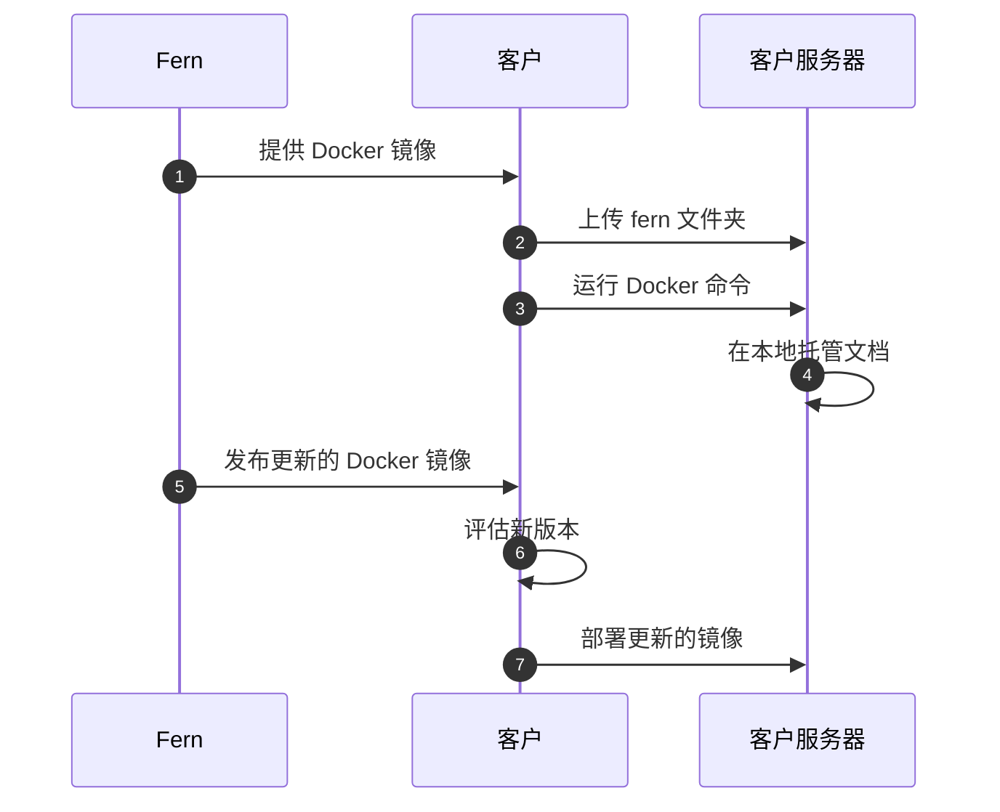

<Markdown src="/snippets/enterprise-plan.mdx" />

Fern 文档网站默认托管在 Fern 的基础设施上。自托管允许您在自己的基础设施上部署文档站点，以满足特定的[安全性](/learn/zh/docs/security/overview)或合规要求。

## 何时使用自托管

自托管通常适用于在无互联网接入环境中运行的组织、有严格合规要求的组织，或需要完全控制文档服务器的组织。

当您选择自托管时，您需要负责服务器设置、安全性、维护，以及决定如何让用户访问文档。

<Warning>
除非您有特定要求无法使用 Fern 的默认托管服务，我们建议**使用我们的托管解决方案**，以便更轻松地进行设置和维护。
</Warning>

<Accordion title="功能支持">

自托管部署包含 Fern 文档网站的核心功能。但是，需要外部连接到 Fern 云服务的功能在自托管环境中不可用。

<Info title="扩展功能支持">
针对自托管部署的 PDF 导出和**离线 AI 聊天功能**正在开发中。如果您对这些功能感兴趣，请[联系我们](mailto:support@buildwithfern.com)。
</Info>

| 功能 | 是否支持 |
|---------|-----------|
| [AI 生成示例](/learn/zh/docs/ai-features/ai-examples) | 否 |
| [分析 + 集成](/learn/zh/docs/integrations/overview) | 否 |
| [公告横幅](/learn/zh/docs/customization/announcement-banner) | 是 |
| [API 浏览器](/learn/zh/docs/api-references/api-explorer) | 是 |
| [API 密钥注入](/learn/zh/docs/authentication/features/api-key-injection) | 是 |
| [API 参考](/learn/zh/docs/api-references/overview) | 是 |
| [Ask Fern](/learn/zh/docs/ai-features/ask-fern/overview) | 否 |
| [更新日志页面](/learn/zh/docs/configuration/changelogs) | 是 |
| [组件库](/learn/zh/docs/writing-content/components/overview) | 是 |
| [自定义品牌和主题](/learn/zh/docs/configuration/site-level-settings) | 是 |
| [自定义 CSS 和 JS](/learn/zh/docs/customization/custom-css-js) | 是 |
| [自定义域名](/learn/zh/docs/preview-publish/setting-up-your-domain) | 是 |
| [自定义 React 组件](/learn/zh/docs/customization/custom-react-components) | 是 |
| [深色/浅色模式](/learn/zh/docs/configuration/site-level-settings) | 是 |
| [嵌入模式](/learn/zh/docs/customization/embedded-mode) | 是 |
| [Fern Editor](/learn/zh/docs/writing-content/fern-editor) | 否 |
| [Fern Writer](/learn/zh/docs/ai-features/fern-writer) | 否 |
| [页眉和页脚自定义](/learn/zh/docs/customization/header-and-footer) | 是 |
| [健康检查端点](/learn/zh/docs/self-hosted/health-check-endpoints) | 是 |
| [HTTP 代码片段](/learn/zh/docs/api-references/http-snippets) | 是 |
| [Intercom](/learn/zh/docs/integrations/support/intercom) | 否 |
| [基于 JWT 的身份验证](/learn/zh/docs/self-hosted/authentication) | 是 |
| [llms.txt](/learn/zh/docs/ai-features/llms-txt) | 是 |
| [导航和侧边栏](/learn/zh/docs/configuration/navigation) | 是 |
| [OAuth](/learn/zh/docs/authentication/setup/oauth) | 否 |
| [页面内反馈](/learn/zh/docs/self-hosted/set-up#on-page-feedback) | 是 |
| [页面级访问控制](/learn/zh/docs/configuration/page-level-settings) | 是 |
| [密码保护](/learn/zh/docs/self-hosted/authentication) | 是 |
| [RBAC](/learn/zh/docs/authentication/features/rbac) | 否 |
| [重定向](/learn/zh/docs/seo/redirects) | 是 |
| [可复用代码片段](/learn/zh/docs/writing-content/reusable-snippets) | 是 |
| [SDK 代码片段](/learn/zh/docs/api-references/sdk-snippets) | 是 |
| [搜索](/learn/zh/docs/customization/search) | 是 |
| [SEO 元数据](/learn/zh/docs/seo/setting-seo-metadata) | 是 |
| [SSO](/learn/zh/docs/authentication/setup/sso) | 否 |
| [标签页](/learn/zh/docs/configuration/tabs) | 是 |
| [产品](/learn/zh/docs/configuration/products) | 是 |
| [版本](/learn/zh/docs/configuration/versions) | 是 |

</Accordion>

## 设置流程

Fern 以即时可运行的 Docker 容器形式提供您的文档站点，您可以在自己的基础设施上部署。详细说明请参见[设置自托管文档](/learn/zh/docs/self-hosted/set-up)。

1. **通过 Docker Hub 进行身份验证** - 使用 Fern 提供的组织访问令牌 (OAT) 登录
1. **下载 Docker 镜像** - 拉取 `fernenterprise/fern-self-hosted` 镜像
1. **上传您的 fern 文件夹** - 将您的文档源文件添加到容器中
1. **运行容器** - 使用标准 Docker 命令启动本地服务器
1. **部署** - 设置服务器环境并发布文档
1. **接收更新的 Docker 镜像** - Fern 发布新版本的 Docker 镜像，您的团队可以评估并在准备就绪时进行部署。

### 架构图

## 监控和健康检查

自托管容器在端口 8081 上包含[健康检查端点](./health-check-endpoints)，用于 Kubernetes 和 Helm 部署。