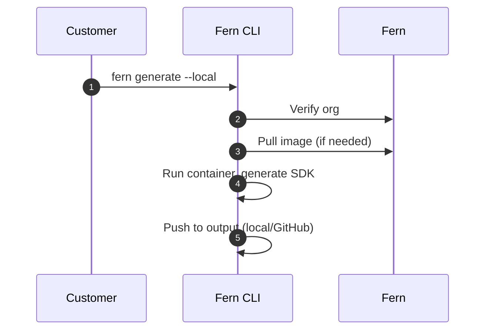

<Markdown src="/snippets/enterprise-plan.mdx" />

Fern SDK 生成[默认运行在 Fern 的基础设施上](/sdks/overview/how-it-works)。自托管允许您在自己的基础设施上运行 SDK 生成。如果您的组织有以下需求，可以使用自托管：

- 在没有互联网访问的环境中运行
- 有严格的合规或安全要求
- 需要完全控制您的 SDK 生成过程

当您使用自托管时，您负责基础设施管理和 SDK 分发。自托管 SDK 生成包含[所有 Fern SDK 功能](/learn/sdks/overview/capabilities)。

<Info>
除非您有特定的要求阻止使用 Fern 的默认托管服务，否则我们建议**使用我们的托管云生成解决方案**，以便更容易设置和维护。
</Info>

## 设置

<Info>
本页面假设您已经：

* 初始化了 `fern` 文件夹。请参阅[设置 `fern` 文件夹](/sdks/overview/quickstart)。
* 在 `generators.yml` 中配置了 SDK 生成器。请参阅特定语言的快速开始指南：[TypeScript](/sdks/generators/typescript/quickstart)、[Python](/sdks/generators/python/quickstart)、[Go](/sdks/generators/go/quickstart)、[Java](/sdks/generators/java/quickstart) 等。
</Info>

自托管 SDK 生成允许您输出到本地文件系统或直接推送到您控制的 GitHub 仓库。按照以下步骤设置和运行本地生成：

<Steps>
<Step title="确保 Docker 正在运行">

验证您的机器上正在运行 Docker 守护程序，因为 SDK 生成运行在 Docker 容器内：

```bash
docker ps
```

</Step>

<Step title="生成 Fern token">

生成一个 Fern token，这是本地生成验证您的组织所必需的。

```bash
fern token
```

该 token 特定于您在 `fern.config.json` 中定义的组织，并且不会过期。

</Step>

<Step title="配置输出位置">

配置您的 `generators.yml` 以将 SDK 输出到本地文件系统或您控制的 GitHub 仓库。

<Tabs>
<Tab title="本地文件系统" language="local">

将生成的 SDK 直接输出到本地目录：

```yaml title="generators.yml" {7-8}
groups:
  python-sdk:
    generators:
      - name: fern-python-sdk
        version: 4.0.0
        output:
          location: local-file-system
          path: ../sdks/python
```

</Tab>
<Tab title="GitHub 仓库" language="github">

要将生成的 SDK 推送到您的 GitHub 仓库，请使用 `uri` 和 `token` 配置 `github` 属性。将发布 [`mode`](/learn/sdks/reference/generators-yml#github) 设置为 `push` 进行直接提交，或设置为 `pull-request` 创建 PR。

```yaml title="generators.yml" {4-8}
groups:
  python-sdk:
    generators:
      - name: fern-python-sdk
        version: 4.0.0
        github:
          uri: https://github.com/your-org/python-sdk
          token: ${GITHUB_TOKEN}
          mode: push
          branch: main
```

</Tab>
</Tabs>
</Step>

<Step title="设置身份验证">

根据您选择的输出位置配置身份验证。

<Tabs>
<Tab title="本地文件系统" language="local">

将您的 Fern token 设置为环境变量：

```bash
export FERN_TOKEN=your-generated-token
```

</Tab>
<Tab title="GitHub 仓库" language="github">

设置 GitHub secrets 进行身份验证。在您的仓库的 **Settings** > **Secrets and variables** > **Actions** 中添加：

- `FERN_TOKEN`：您上面生成的 token
- `GITHUB_TOKEN`：具有仓库写权限的 [GitHub 个人访问 token](https://docs.github.com/en/authentication/keeping-your-account-and-data-secure/managing-your-personal-access-tokens)

</Tab>
</Tabs>
</Step>

<Step title="本地运行生成">

使用 `--local` 标志在本地生成 SDK，而不是使用 Fern 的云基础设施。您可以将 `--local` 与 `--group` 结合使用，以在本地生成特定的 SDK。

```bash
fern generate --local
fern generate --group python-sdk --local
```

<Accordion title="可选：配置自定义容器注册表">

默认情况下，`fern generate --local` 从 Docker Hub 拉取生成器 Docker 镜像。如果您的组织将 Fern 的镜像镜像到私有注册表中，您可以配置 CLI 从该注册表拉取。
要使用自定义注册表，请将生成器配置中的 `name` 字段替换为包含 `name` 和 `registry` 的 [`image`](http://localhost:3000/learn/sdks/reference/generators-yml#image) 对象：

```yaml title="generators.yml" {4-6}
groups:
  python-sdk:
    generators:
      - image:
          name: fern-python-sdk
          registry: ghcr.io/your-org
        version: <Markdown src="/snippets/version-number-python.mdx"/>
        output:
          location: local-file-system
          path: ../sdks/python
```

<Info>
  `image.name` 必须是已识别的 Fern 生成器名称（例如 `fern-python-sdk` 或 `fern-typescript-sdk`）。这确保 CLI 可以为您的生成器解析正确的 IR 版本。`version` 也必须与已发布的 Fern 生成器版本匹配。
</Info>

使用自定义 `image` 配置的生成器在 `fern generator upgrade` 时会被跳过。您必须手动更新这些生成器的版本。

如果您的注册表需要身份验证，请在运行 `fern generate --local` 之前登录。CLI 使用 Docker 存储的凭据。

```bash
# 示例：向 GitHub Container Registry 进行身份验证
echo $CR_PAT | docker login ghcr.io -u USERNAME --password-stdin

# 然后照常运行本地生成
fern generate --local
```

</Accordion>

</Step>
</Steps>

## 工作原理

当您运行 `fern generate --local` 时，Fern CLI 在您的本地机器上执行 SDK 生成，而不是使用 [Fern 的云基础设施](/learn/sdks/overview/how-it-works)。

<Tip>
无论您使用云生成还是自托管生成，底层的 SDK 生成架构都是相同的。有关详细信息，请参阅[扩展架构图](/learn/sdks/overview/how-it-works#expanded-architecture)。
</Tip>

自托管过程的工作流程如下：

1. **组织验证**（网络调用）- CLI 向 Fern 验证您的组织注册
1. **下载生成器镜像**（如未缓存则进行网络调用）- 如果本地尚未提供，CLI 下载生成器的 Docker 镜像
1. **生成 SDK**（本地）- CLI 在本地运行生成器容器，根据您的 API 定义和 `generators.yml` 配置生成 SDK 文件
1. **输出 SDK**（本地）- 生成的 SDK 文件保存到您配置的输出位置（本地文件系统或 GitHub 仓库）

步骤 1 和 2 是使用 `--local` 标志时唯一的网络调用。没有 API 定义或规范数据通过网络发送：所有 SDK 生成都在您的机器上本地进行。

