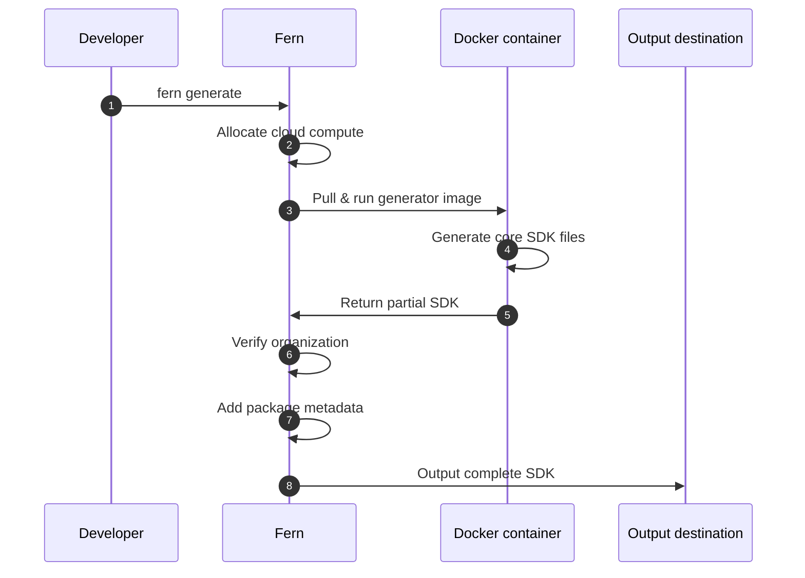

Fern 将您的 API 规范与生成器配置和自定义代码相结合，生成多种语言的 SDK。默认情况下，SDK 生成运行在 Fern 的托管云基础设施上。

或者，[您可以在自己的基础设施上运行 SDK 生成](/learn/zh/sdks/deep-dives/self-hosted)以满足特定的安全或合规要求。

## 云生成工作流

在生成 SDK 之前，您需要配置 `fern/` 文件夹，在 `generators.yml` 中指定 SDK 生成器并连接您的 API 规范。您还可以根据需要添加自定义代码、测试和其他配置。

运行 `fern generate` 会启动云生成过程，涉及几个关键步骤：

<Steps>
<Step title="云执行">
Fern 分配计算资源并拉取适合您指定生成器版本的 Docker 镜像。
</Step>
<Step title="生成核心 SDK">
Docker 容器执行生成逻辑并生成您 SDK 的核心文件（模型、客户端代码、API 方法）。
</Step>
<Step title="验证组织">
Fern 验证您的组织注册以确保可以生成完整的 SDK。如果没有组织验证，只会生成部分 SDK 文件（核心代码但不包含包元数据）。
</Step>
<Step title="添加包元数据">
Fern 通过添加包分发文件（如 `pyproject.toml`、`package.json`、README 和任何依赖项）来完成 SDK。
</Step>
<Step title="输出到目标位置">
Fern 将完整的 SDK 发布或保存到您配置的位置（本地文件系统、GitHub 仓库、包注册表）。发布后，开发人员可以使用您的 SDK 与您的 API 集成。
</Step>
</Steps>

<AccordionGroup>
<Accordion title="云生成时序图">

</Accordion>

<Accordion title="扩展架构图" anchor="expanded-architecture">
<Frame>

</Frame>
</Accordion>
</AccordionGroup>

## 配额

云（远程）生成使用[漏桶](https://en.wikipedia.org/wiki/Leaky_bucket)限流算法，具有以下默认限制：

| 参数 | 值 |
| --- | --- |
| 突发容量 | 10 次生成 |
| 补充率 | 每分钟 5 次生成 |

您可以连续快速运行多达 10 次生成。然后 Fern 以每分钟 5 次生成的速度补充您的配额，因此如果您达到限制，后续请求将被限流，直到恢复足够的容量。在实际使用中，这只会影响在紧密循环中触发许多生成的自动化工作流——偶尔的手动运行不会接近限制。

<Note>
限流仅适用于云生成。使用 `--local` 的[本地生成](/learn/zh/sdks/deep-dives/self-hosted)不受任何配额限制。
</Note>

如果您的团队需要更高的配额，请联系 support@buildwithfern.com。