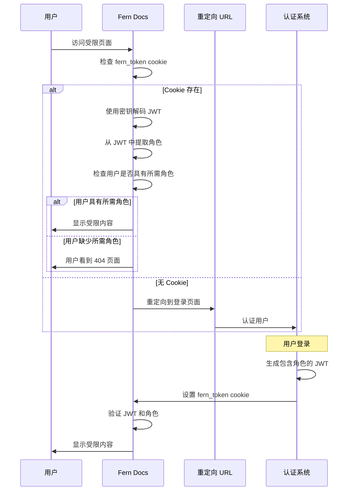

```mermaid
sequenceDiagram
    participant U as 用户
    participant F as Fern Docs
    participant R as 重定向 URL
    participant A as 认证系统

    U->>F: 访问受限页面
    F->>F: 检查 fern_token cookie
    
    alt Cookie 存在
        F->>F: 使用密钥解码 JWT
        F->>F: 从 JWT 中提取角色
        F->>F: 检查用户是否具有所需角色
        
        alt 用户具有所需角色
            F->>U: 显示受限内容
        else 用户缺少所需角色
            F->>U: 用户看到 404 页面
        end
    else 无 Cookie
        F->>R: 重定向到登录页面
        R->>A: 认证用户
    end
    
    Note over A: 用户登录
    
    A->>A: 生成包含角色的 JWT
    A->>F: 设置 fern_token cookie
    F->>F: 验证 JWT 和角色
    F->>U: 显示受限内容
```