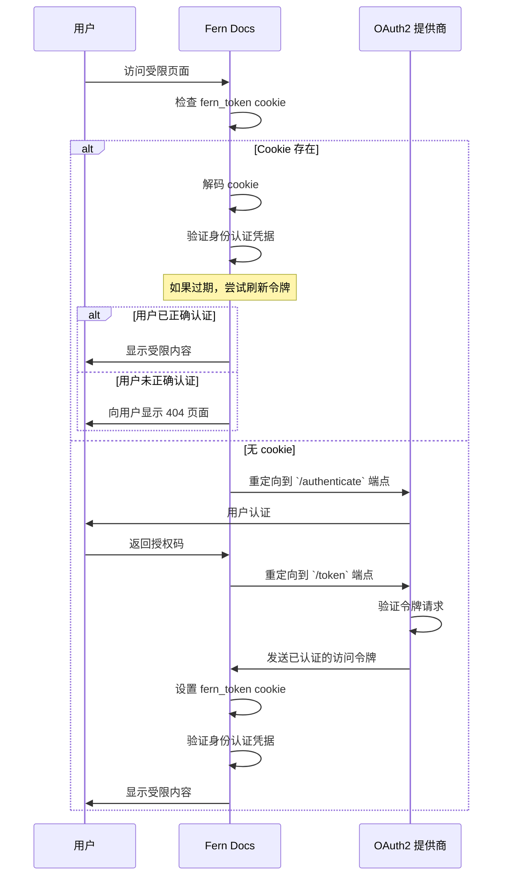

```mermaid
sequenceDiagram
    participant U as 用户
    participant F as Fern Docs
    participant A as OAuth2 提供商
    U->>F: 访问受限页面
    F->>F: 检查 fern_token cookie
    
    alt Cookie 存在
        F->>F: 解码 cookie
        F->>F: 验证身份认证凭据
        Note over F: 如果过期，尝试刷新令牌
        
        alt 用户已正确认证
            F->>U: 显示受限内容
        else 用户未正确认证
            F->>U: 向用户显示 404 页面
        end
    else 无 cookie
        F->>A: 重定向到 `/authenticate` 端点
        A->>U: 用户认证
        U->>F: 返回授权码
        F->>A: 重定向到 `/token` 端点
        A->>A: 验证令牌请求
        A->>F: 发送已认证的访问令牌
        F->>F: 设置 fern_token cookie
        F->>F: 验证身份认证凭据
        F->>U: 显示受限内容
    end
```