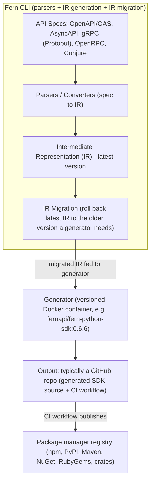

# How Fern generates SDKs

```mermaid
flowchart TD
    subgraph CLI["Fern CLI (parsers + IR generation + IR migration)"]
        SPECS["API Specs: OpenAPI/OAS, AsyncAPI, gRPC (Protobuf), OpenRPC, Conjure"]
        PARSE["Parsers / Converters (spec to IR)"]
        IR["Intermediate Representation (IR) - latest version"]
        MIG["IR Migration (roll back latest IR to the older version a generator needs)"]
        SPECS --> PARSE --> IR --> MIG
    end

    GEN["Generator (versioned Docker container, e.g. fernapi/fern-python-sdk:0.6.6)"]
    OUT["Output: typically a GitHub repo (generated SDK source + CI workflow)"]
    PKG["Package manager registry (npm, PyPI, Maven, NuGet, RubyGems, crates)"]

    MIG -->|"migrated IR fed to generator"| GEN
    GEN --> OUT
    OUT -->|"CI workflow publishes"| PKG
```
